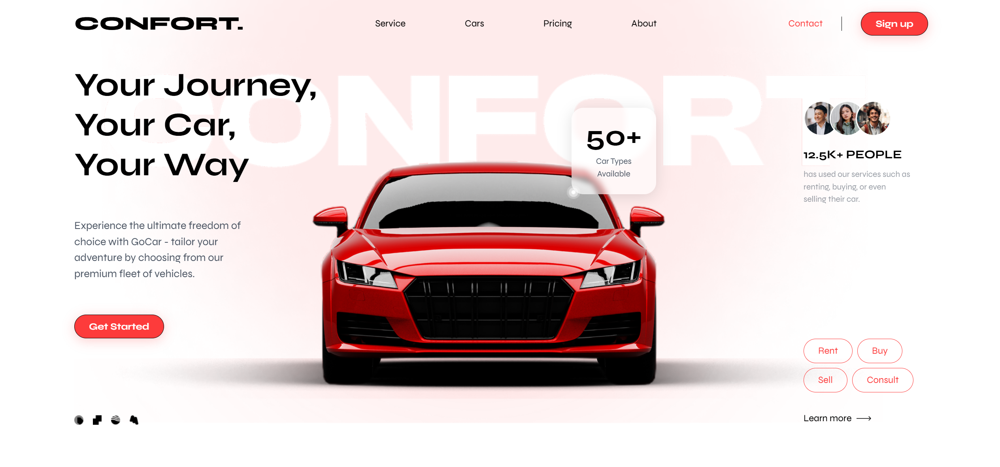

# Car Renting App Landing Page

This is a simple and elegant landing page for a car renting app. It is designed to attract users and provide them with essential information about the app, including quick links, car details, social media, and a newsletter subscription.

## Features

- **Responsive Design**: The landing page is fully responsive and works seamlessly on all devices.
- **Newsletter Subscription**: Users can subscribe to the newsletter to receive exclusive deals and updates.
- **Quick Links**: Easy navigation to important sections like About Us, Who We Are, and Contact Us.
- **Car Information**: Detailed information about how the app works, picking a car, and FAQs.
- **Social Media Links**: Connect with the app on Instagram, Facebook, and Twitter.

## Technologies Used

- **React**: For building the user interface.
- **Tailwind CSS**: For styling the components.
- **TypeScript**: For type safety and better development experience.

## Getting Started

Follow these instructions to set up and run the project locally.

### Prerequisites

- Node.js and npm installed on your machine.

### Installation

1. Clone the repository:
   ```bash
   git clone https://github.com/mootezbh/LandingPage.git
   ```
2. Navigate to the project directory:
   ```bash
   cd LandingPage
   ```
3. Install the dependencies:
   ```bash
   npm install
   ```

### Running the Project

1. Start the development server:
   ```bash
   npm run dev
   ```
2. Open your browser and go to `http://localhost:5173/` to see the landing page.

## Screenshots



## Contact

For any inquiries or feedback, please contact me at [benhammouda99@gmail.com](benhammouda99@gmail.com).
